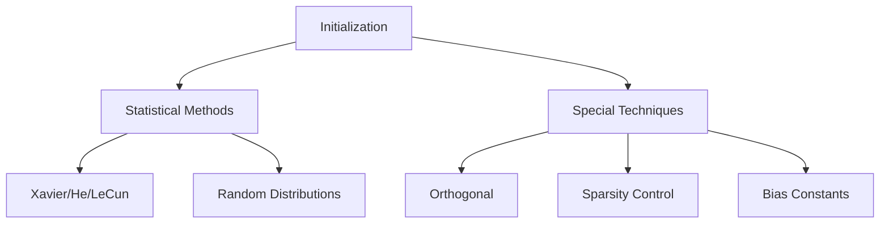
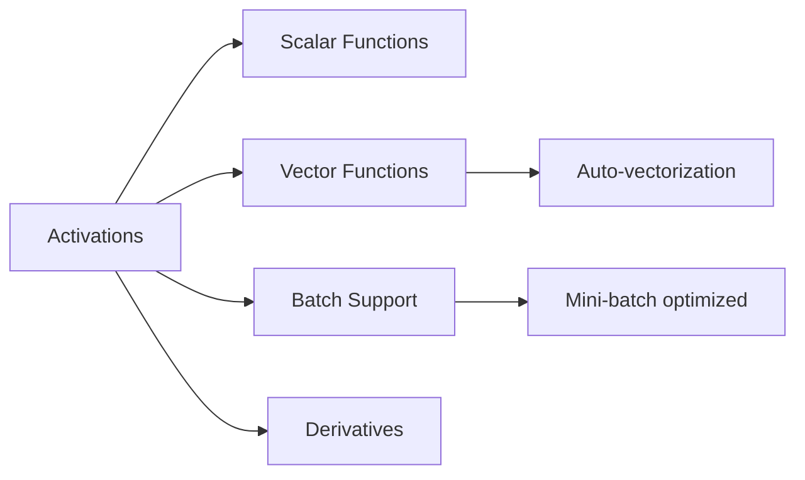

# 🧩 **Utils Module Documentation**

---

## 📦 Overview
The **Utils** module provides core utilities for neural network development:
- **Parameter Initialization**: Methods for weight initialization
- **Activation Functions**: Forward and derivative computations

---

## 📂 Folder Structure
| File                               | Description                          |
| ---------------------------------- | ------------------------------------ |
| `include/Utils/Initialization.h`   | Weight initialization declarations    |
| `include/Utils/Activations.h`      | Activation function declarations     |
| `src/Utils/Initialization.cpp`     | Initialization implementations       |
| `src/Utils/Activations.cpp`        | Activation implementations           |

---

## ⚙️ **Part 1: Parameter Initialization**

### Supported Methods
| Method          | Best For             | Formula                                                                 |
|-----------------|----------------------|-------------------------------------------------------------------------|
| **Xavier Uniform** | Sigmoid/Tanh        | \$U(-\sqrt{\frac{6}{in+out}}, \sqrt{\frac{6}{in+out}})\$                |
| **He Normal**     | ReLU                | \$\mathcal{N}(0, \sqrt{\frac{2}{in}})\$                                 |
| **LeCun Uniform** | SELU                | \$U(-\sqrt{\frac{3}{in}}, \sqrt{\frac{3}{in}})\$                        |
| **Orthogonal**    | RNNs                | QR decomposition via Gram-Schmidt                                       |
| **Bias**          | Output layers       | Constant value                                                          |
| ... (*7 others*) |                      |                                                                         |

### Key Features



### Development Journey
| **Challenge**                     | **Solution**                                      |
|-----------------------------------|---------------------------------------------------|
| Orthogonal init for non-square    | Added runtime validation and clear error messages |
| Extreme outliers in normal dist   | Implemented clamping with configurable bounds    |
| Reproducibility issues            | Added explicit seed control                       |
| Sparse init performance           | Post-init masking with probability sampling       |

### Future Improvements
1. **Architectural Support**:
   - Convolutional kernel initialization
   - Attention weight initialization
2. **Advanced Methods**:
   - Kaiming initialization with mode selection
   - Sparse structured patterns (block-diagonal)
3. **Precision Handling**:
   - Mixed-precision support (FP16/FP32)
   - Quantization-aware initialization
4. **API Enhancements**:
   - Layer-specific initialization policies
   - Automatic method selection based on activation

---

## 🔥 **Part 2: Activation Functions**

### Available Activations
| Function       | Equation                          | Derivative                          |
|----------------|-----------------------------------|-------------------------------------|
| **Sigmoid**    | \$\sigma(x) = \frac{1}{1+e^{-x}}\$ | \$\sigma'(x) = \sigma(x)(1-\sigma(x))\$ |
| **ReLU**       | \$max(0, x)\$                    | \$1\$ if \$x>0\$ else \$0\$         |
| **Tanh**       | \$\tanh(x)\$                     | \$1 - \tanh^2(x)\$                 |
| **Softmax**    | \$\frac{e^{x_i}}{\sum e^{x_j}}\$ | Jacobian matrix                     |
| **Softplus**   | \$\ln(1+e^x)\$                   | \$\sigma(x)\$                       |

### Key Features



### Implementation Highlights
1. **Numerical Stability**:
   - Softmax: Max subtraction + epsilon guards
   - Sigmoid: Safe exponent handling
2. **Performance**:
   - Batch processing with pre-allocation
   - Element-wise SIMD optimizations
3. **API Design**:
   - Consistent scalar/vector/batch interfaces
   - Separate derivative functions

### Future Improvements
1. **Extended Function Set**:
   - GELU, Swish, Mish
   - Learnable activations (PReLU)
2. **Performance Optimization**:
   - GPU acceleration (CUDA kernels)
   - AVX vectorization
3. **Advanced Capabilities**:
   - Sparse activations
   - Stochastic variants (ReLU dropout)
4. **Tooling Integration**:
   - Activation distribution visualization
   - Gradient flow analysis

---

## 📚 **Key Learnings**

### Cross-Cutting Insights
1. **Numerical Stability**:
   - Essential for deep networks (softmax, sigmoid)
   - Epsilon guards prevent NaN/Inf
2. **API Consistency**:
   - Unified patterns across initializations and activations
   - Scalar/vector/batch parity
3. **Performance Matters**:
   - Batch processing critical for real-world use
   - Pre-allocation beats push_back

### Initialization-Specific
- Orthogonal init requires careful GS implementation
- Sparsity should be applied post-initialization
- Seed control enables reproducible experiments

### Activation-Specific
- Softmax derivatives are most efficient with CE loss
- ReLU benefits from negative slope parameter
- Batch normalization often needed with saturating activations

---

## 🚀 **Future Roadmap**

### High Priority
| Module           | Feature                          |
|------------------|----------------------------------|
| Initialization   | Convolutional kernel support     |
| Activations      | FP16 precision                   |
| Both             | GPU acceleration                 |

### Advanced Features
| Module           | Feature                          |
|------------------|----------------------------------|
| Initialization   | Automatic method selection       |
| Activations      | Activation clustering analysis   |
| Both             | ONNX export support             |

### Tooling Enhancements
- Visual initialization diagnostics
- Activation distribution profiler
- Gradient flow visualization

---

## 🏷️ Namespace Organization

```
namespace Activations { ... }
```
(only for Activations.h)


---

## ⏳ **Conclusion**
The Utils module provides foundational building blocks for neural network development. Through careful implementation of numerical methods and API design, we've created robust, extensible utilities suitable for both research and production use. Future work will focus on performance optimization and expanded functionality while maintaining backward compatibility.
